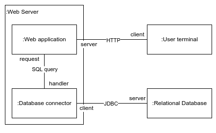
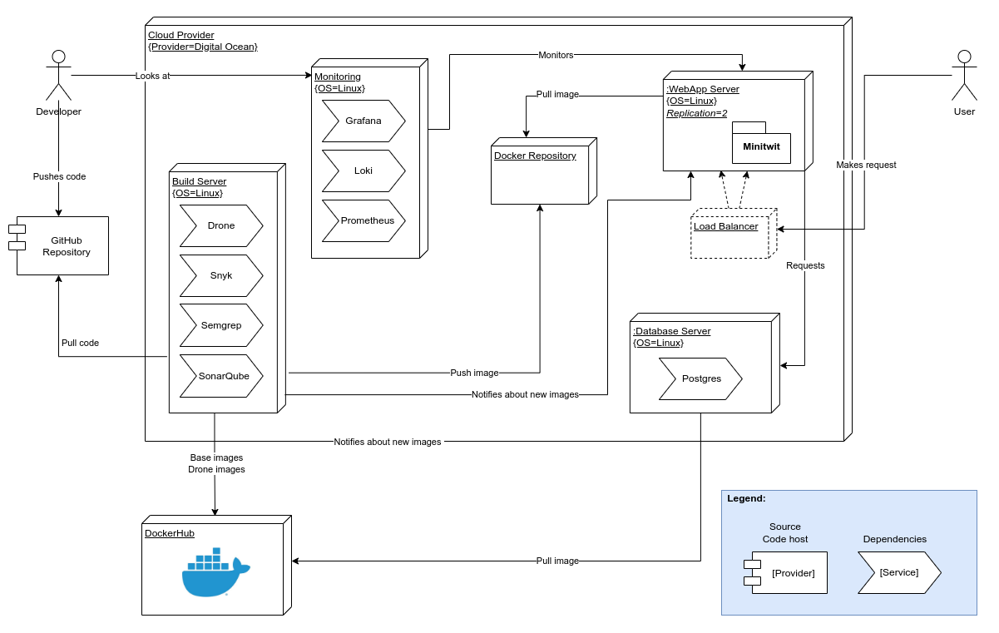

//the digram with all servers, systems, etc https://app.diagrams.net/#G1_JgXAicq9f5uZ3SJW8pnrSKhg9PYnSlH

//docker too?

=== Architecture

The Minitwit application is built on a client-server architecture. When connecting to Minitwit through a browser, users will interact with a web server. This web server stores all information about its users in a https://www.postgresql.org/[PostgreSQL] database. 

.An overview of the runtime interaction in the system. 

The web application consists of two Java classes: _WebApplication_ and _SqlDatabase_. The first encapsulates the entire Minitwit application and receives user requests, while the latter handles connections to the database initiated by _WebApplication_. Essentially, we kept the simple structure from the original Python application. At the time of writing, we have been working on splitting the _WebApplication_ class into multiple classes to improve cleanliness and maintainability. As an illustration, we have moved logic related to user messages into its own class in https://github.com/Herover/itu-devops-h/pull/163[this pull request]. This process is not done however, which is why we present the web application as a single class in this section.

.An overview of the two Java classes making up the Minitwit application.

The entire Minitwit system, including the web servers, database, CI and monitoring, is hosted on https://www.digitalocean.com/[DigitalOcean]. To interact with and modify the servers hosted on DigitalOcean we use https://www.terraform.io/[Terraform].  

For aggregating and querying logs we use https://grafana.com/oss/loki/[Grafana Loki], where the output of these logs and the current state of the system is monitored by https://grafana.com/grafana/[Grafana] using metrics from https://grafana.com/grafana/dashboards/3662[Prometheus].

Whenever a pull request is merged to the main branch, the build server provided by https://www.drone.io/[Drone] will build a https://docker.com[Docker] image based on the new code and push it to the https://www.digitalocean.com/products/container-registry[DigitalOcean Container Registry]. The build server then notifies the two web servers that there is a new image ready, thus allowing them to pull it and deploy the new code.

The database server as well as the Drone server and the monitoring server pull images from https://hub.docker.com/[DockerHub] with all their necessary dependencies on creation. 

.An overview of the Minitwit infrastructure, showcasing the deployment pipeline.

// Ad line between Monitoring and Dockerhub like Build Server has, change the notify line "from docker repository to load balancer" to be "from build server to WebApp Server"