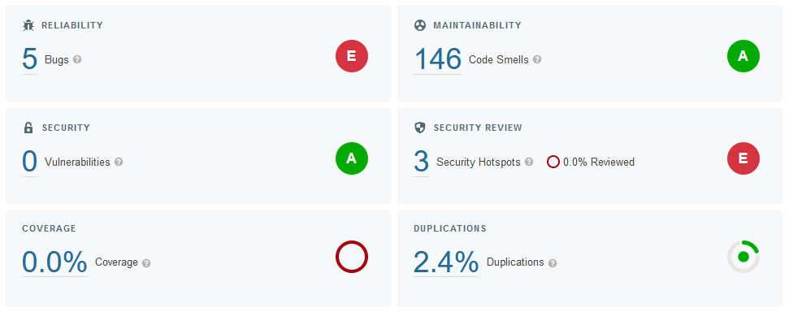

=== Quality Assessment
We made use of various tools in the project to keep track of the quality of our code and avoid introducing new bugs. This section will describe each of these tools and how we used them.

==== Maintainability and Technical Debt
To evaluate the maintainability and technical debt of our code we used three tools: SonarQube, Code Climate and Better Code Hub. In particular, SonarQube was added as a stage in our build chain so that we could track the current code quality for every pull request. SonarQube keeps track of issues such as bugs and security vulnerabilities as well as issues pertaining to maintainability such as bad code style (which SonarQube has labeled 'code smells').

Due to the structure of the course, we added these tools after having refactored the application from Python to Java. We had limited time to accomplish this refactoring and create a working application, which naturally led to a lot of code smells being exposed by the tools. We made sure to fix the most critical bugs that the tools found at the time, but decided to leave the majority of the code smells as we had to prioritize the other weekly tasks. Instead, we made sure that any new Minitwit features would not introduce more code smells than we already had. This meant that a pull request was not allowed to be merged to production if it got a worse rating than the original code.

[#img-sonar]
.The current software quality rating of our project, analyzed by SonarQube. As can be derived from the image, we did not manage to include unit testing due to time constraints.

==== Static Analysis
To conduct static analysis we made use of ErrorProne, Snyk and Semgrep. The first tool, ErrorProne, checked for errors and bug patterns at compile-time, blocking builds if one occurred. The latter two were added as stages in our build chain and thus also ensured that pull requests did not introduce new bugs or security vulnerabilities.
